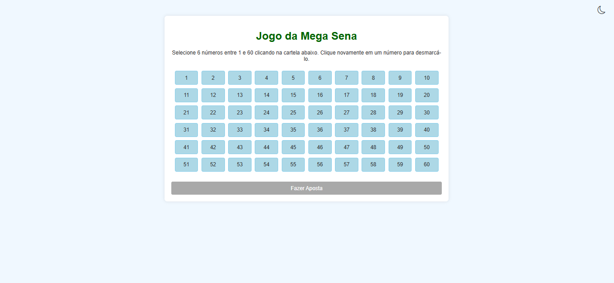
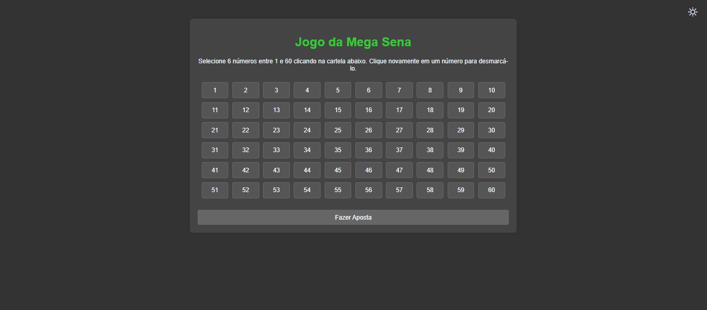
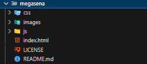

# 🌟 Jogo da Mega Sena

Bem-vindo ao repositório do Jogo da Mega Sena, um projeto web interativo e visualmente vibrante desenvolvido com HTML, CSS e JavaScript. Este jogo simula a experiência da Mega Sena, permitindo que você faça sua aposta, veja o sorteio e descubra se ganhou prêmios incríveis — tudo com uma interface moderna e suporte a temas claro e escuro!

## 📸 Preview




## Acesse ➡️ https://kiminfodeveloper.github.io/portfolioDev/index.html

## ✨ Funcionalidades

-   🎰 Cartela interativa: Escolha 6 números de 1 a 60 clicando diretamente na cartela, com opção de desmarcar números.
-   🖌️ Temas claro e escuro: Alterne entre temas com um botão interativo, usando ícones de sol e lua do Bootstrap Icons.
-   ✅ Validação inteligente: O botão de aposta só é liberado quando exatamente 6 números são selecionados, ficando verde para indicar ação.
-   📊 Resultados dinâmicos: Veja os números sorteados, sua aposta, número de acertos e mensagens de premiação (quadra, quina ou sena).
-   📱 Design responsivo: Funciona perfeitamente em desktops, tablets e smartphones.
-   💾 Persistência de tema: A escolha do tema é salva no navegador para uma experiência consistente.
-   🎨 Visual vibrante: Cores modernas com tons de verde, azul, laranja e cinza, otimizadas para legibilidade.

## 🗂️ Estrutura de Pastas



## 🌐 Troca de Temas

O projeto inclui um sistema de troca de temas que usa o localStorage para salvar a preferência do usuário. O botão de alternância exibe um ícone de lua (tema claro) ou sol (tema escuro), garantindo uma transição suave entre os modos.

## 🚀 Como Executar Localmente

Clone o repositório:

```bash
        git clone https://github.com/kiminfodeveloper/megasena
```

Abra o arquivo index.html no seu navegador.

Nenhum servidor local é necessário, já que o projeto é totalmente estático.

## 🛠️ Tecnologias Utilizadas

-   HTML5: Estrutura semântica e acessível.
-   CSS3: Variáveis CSS, grid para a cartela, design responsivo e transições suaves.
-   JavaScript: Manipulação do DOM, lógica do jogo, validações e persistência de dados.
-   Bootstrap Icons: Ícones de sol e lua para o botão de troca de tema.

## 📌 Possíveis Melhorias Futuras

-   🌍 Suporte a múltiplos idiomas para instruções do jogo.
-   🎨 Mais opções de temas ou personalização de cores.
-   📈 Histórico de apostas salvas no localStorage.
-   🔔 Animações para o sorteio dos números.
-   🔗 Integração com uma API para resultados reais da Mega Sena (se disponível).

## 📄 Licença

Este projeto está sob a licença MIT. Veja o arquivo LICENSE para mais detalhes.

## 👨‍💻 Desenvolvido por Kevyn Melo
